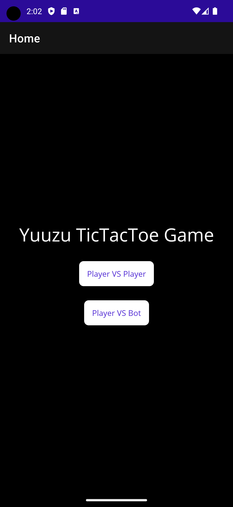
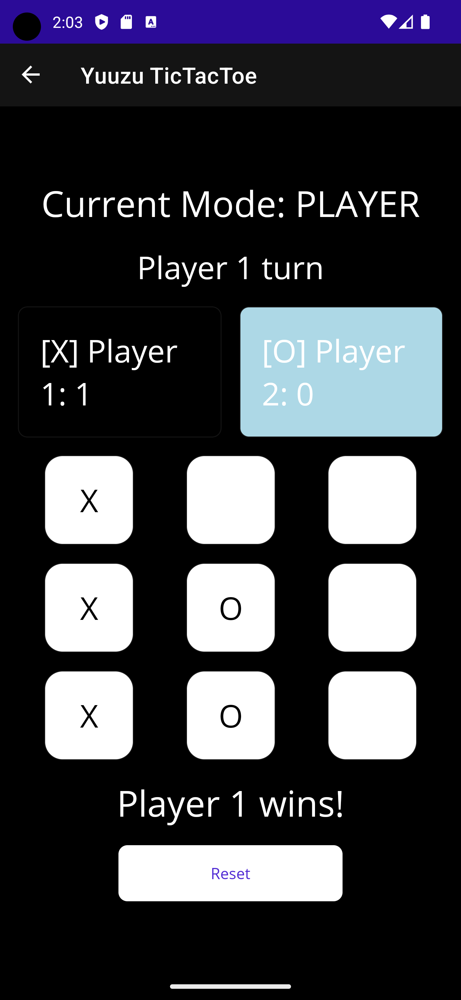
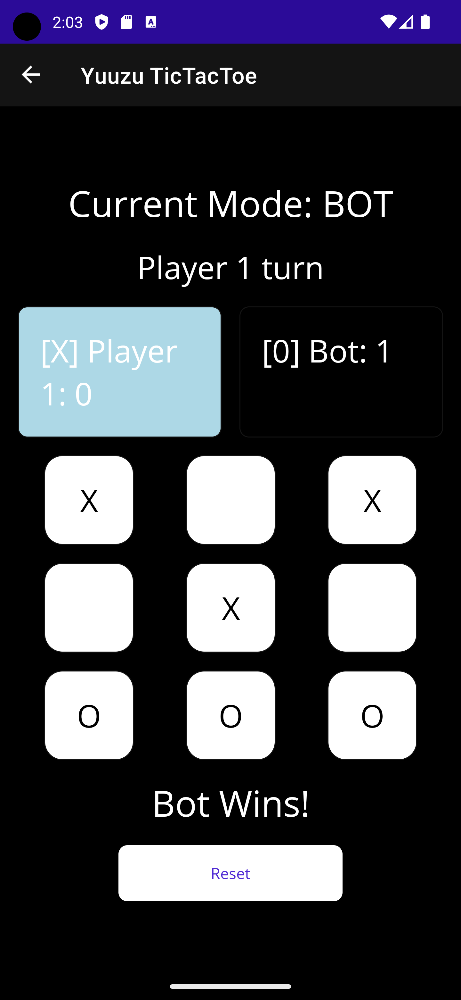

# TicTacToe_MAUI

## English Version
## Introduction
This is a Tic-Tac-Toe game project developed using .NET MAUI (Multi-platform App UI). The game supports both single-player and two-player modes.

## Screenshots & Demo
<div style="overflow-x: auto;">
    <table>
    <tr>
        <td></td>
        <td></td>
        <td></td>
    </tr>
    </table>
</div>

## Features
- **Single-Player Mode**: Play against a smart Bot.
- **Two-Player Mode**: Play face-to-face with friends or family.
- **User-Friendly**: Simple UI and intuitive operations.

## Installation
```bash
git clone https://github.com/NakiriYuuzu/TicTacToe_MAUI.git
```
1. Git clone the project.
2. Open the FirstMaui.sln file.
3. Compile and run the project.

## Technologies Used
- .NET MAUI
- C#
- MVVM Architecture

## Developer
- [NakiriYuuzu](https://github.com/NakiriYuuzu)

## 中文版本
## 簡介
這是一個使用 .NET MAUI（Multi-platform App UI）開發的井字遊戲（Tic-Tac-Toe）專案。遊戲支持單人和雙人模式。

## 功能
- **單人模式**：與智能 Bot 對戰。
- **雙人模式**：與朋友或家人面對面對戰。
- **簡單易用**：簡單的 UI 和直觀的操作。

## 安裝
```bash
git clone https://github.com/NakiriYuuzu/TicTacToe_MAUI.git
```
1. 複製專案。
2. 開啟 FirstMaui.sln 檔案。
3. 編譯並執行專案。

## 使用技術
- .NET MAUI
- C#
- MVVM 架構

## 開發者
- [NakiriYuuzu](https://github.com/NakiriYuuzu)